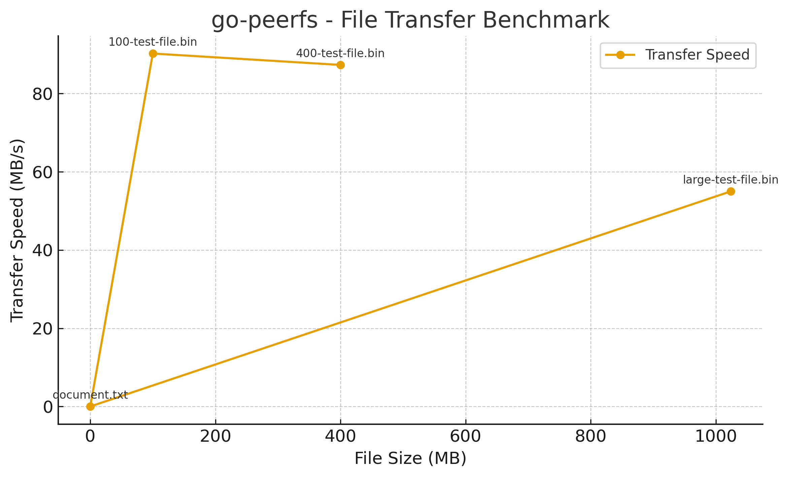

# 🌐 go-peerfs

> *A modern, decentralized peer-to-peer file sharing ecosystem built with Go and libp2p*

**Share and download files directly between computers without a central server** — Experience true decentralized file sharing with enterprise-grade security and lightning-fast discovery.

---

## ✨ Overview

go-peerfs revolutionizes file sharing by creating a distributed network where your computer becomes both a client and a server. Built on the robust libp2p framework, it combines the simplicity of command-line tools with the power of modern P2P networking protocols.

**🎯 Key Advantages:**
- **Zero Infrastructure** — No servers to maintain, no accounts to create
- **Network Resilient** — Works seamlessly on local networks and across the internet
- **Security First** — End-to-end encryption with integrity verification
- **Developer Friendly** — Clean architecture with comprehensive tooling

---

## 🚀 Features

### 🔗 **Truly Decentralized Network**
No central server, no single point of failure — just pure peer-to-peer connections that scale naturally with your network.

### 🛡️ **Enterprise-Grade Security**
- **Encrypted Communications** — All data protected with libp2p's Noise & TLS protocols
- **Integrity Verification** — SHA-256 hash verification prevents data corruption
- **Authenticated Peers** — Cryptographic peer identity verification

### 🎯 **Intelligent Peer Discovery**
- **Local Discovery** — mDNS for instant local network detection
- **Global Discovery** — Kademlia DHT for internet-wide peer finding
- **Hybrid Approach** — Best of both worlds for maximum connectivity

### ⚡ **Modern Architecture**
- **Robust CLI** — Powered by Cobra framework for intuitive commands
- **Client-Server Design** — Persistent daemon with lightweight client interactions
- **HTTP API** — RESTful interface for easy integration
- **Container Ready** — Optimized multi-stage Docker builds

### 🔧 **Developer Experience**
- **CI/CD Pipeline** — Automated testing and builds with GitHub Actions
- **Clean Codebase** — Well-organized, documented, and testable
- **Cross-Platform** — Runs on Linux, macOS, and Windows

---

## 🏁 Quick Start

### Prerequisites

```bash
# Required
Go 1.22+           # Latest Go runtime
GCC or Clang       # C compiler (usually pre-installed)

# Optional
Docker 20.10+      # For containerized deployment
```

### Installation

```bash
# Clone the repository
git clone https://github.com/Yashh56/go-peerfs.git
cd go-peerfs

# Set up your shared directory
mkdir -p shared downloads
echo "Hello, P2P World!" > shared/hello.txt

# Build the application
go build -o go-peerfs ./cmd/go-peerfs
```

### Launch Your Network

Start multiple nodes to create your peer-to-peer network:

#### **Node 1** (Primary)
```bash
./go-peerfs start
# 🚀 Starting go-peerfs daemon on port 8000...
# 🔍 Discovering peers via mDNS and DHT...
# ✅ Ready to share files from ./shared
```

#### **Node 2** (Secondary)
```bash
./go-peerfs start --port 8001
# 🚀 Starting go-peerfs daemon on port 8001...
# 🤝 Connected to peer network
# ✅ Ready to serve requests
```

*Nodes will automatically discover each other within seconds!*

---

## 💡 Usage Guide

### 🔍 **Discover Files**
Search across the entire network for files:

```bash
./go-peerfs search "document"
```

**Output:**
```
┌─────────────────────┬──────────┬────────────────┬─────────────────────┐
│ File Name           │ Size     │ Hash (SHA-256) │ Available Peers     │
├─────────────────────┼──────────┼────────────────┼─────────────────────┤
│ project-docs.pdf    │ 2.4 MB   │ 95a379f4ba...  │ 12D3KooWMy...       │
│ meeting-notes.docx  │ 847 KB   │ 7c2b8f3e91...  │ 12D3KooWPt...       │
└─────────────────────┴──────────┴────────────────┴─────────────────────┘
```

### 📥 **Download Files**
Retrieve files using their hash and peer information:

```bash
./go-peerfs download 95a379f4ba... 12D3KooWMy...
```

**Download Progress:**
```
📥 Downloading project-docs.pdf
████████████████████████████████ 100% | 2.4 MB/2.4 MB | 1.2 MB/s
✅ Download completed: ./downloads/project-docs.pdf
🔒 SHA-256 verified: 95a379f4ba...
```

### 🔄 **Daemon Management**
```bash
# Start daemon with custom configuration
./go-peerfs start --port 8000 --verbose

# Check daemon status
./go-peerfs status

# Stop daemon gracefully
./go-peerfs stop
```

---

## 🐳 Docker Deployment

Perfect for production environments or isolated testing:

### Build Image
```bash
docker build -t go-peerfs:latest .
```

### Single Node
```bash
docker run -d \
  --name peerfs-node1 \
  -p 8000:8000 \
  -v $(pwd)/shared:/app/shared:ro \
  -v $(pwd)/downloads:/app/downloads \
  go-peerfs:latest
```

### Multi-Node Network
```bash
# Node 1
docker run -d --name peer1 -p 8000:8000 \
  -v $(pwd)/shared:/app/shared:ro \
  go-peerfs:latest

# Node 2  
docker run -d --name peer2 -p 8001:8001 \
  -v $(pwd)/shared:/app/shared:ro \
  go-peerfs:latest start --port 8001

# Nodes automatically discover each other
```

### Docker Compose
```yaml
version: '3.8'
services:
  peer1:
    build: .
    ports: ["8000:8000"]
    volumes:
      - ./shared:/app/shared:ro
      - ./downloads:/app/downloads
  
  peer2:
    build: .
    ports: ["8001:8001"]
    volumes:
      - ./shared:/app/shared:ro  
      - ./downloads:/app/downloads
    command: ["start", "--port", "8001"]
```

---

## 🏗️ Architecture

### **System Design**
```
┌─────────────────┐    HTTP API    ┌─────────────────┐
│   CLI Client    │◄──────────────►│  Daemon Server  │
└─────────────────┘                └─────────────────┘
                                           │
                                           │ libp2p
                                           ▼
┌────────────────────────────────────────────────────────┐
│                P2P Network Layer                       │
│  ┌─────────────┐ ┌─────────────┐ ┌─────────────────┐   │
│  │    mDNS     │ │  Kademlia   │ │   File Stream   │   │
│  │  Discovery  │ │     DHT     │ │   Protocol      │   │
│  └─────────────┘ └─────────────┘ └─────────────────┘   │
└────────────────────────────────────────────────────────┘
```

### **Project Structure**
```
go-peerfs/
├── 📁 cmd/go-peerfs/          # CLI entry point & command definitions
├── 📁 pkg/
│   ├── 📁 p2p/                # libp2p networking & peer management  
│   ├── 📁 file/               # File indexing & chunk management
│   ├── 📁 download/           # Download orchestration & verification
│   └── 📁 api/                # HTTP API server & handlers
├── 📁 .github/workflows/      # CI/CD automation pipelines
├── 📁 shared/                 # Your files to share (created at runtime)
├── 📁 downloads/              # Downloaded files destination
├── 🐳 Dockerfile              # Multi-stage container build
└── 📋 docker-compose.yml      # Multi-node deployment config
```

---

## 📈 Benchmarks




---

## 🤝 Contributing

We welcome contributions from the community! Here's how you can help:

### **Development Setup**
```bash
# Fork and clone
git clone https://github.com/your-username/go-peerfs.git
cd go-peerfs

# Install dependencies
go mod tidy

# Run tests
go test ./...

# Run with race detection
go run -race ./cmd/go-peerfs start
```

### **Contribution Guidelines**
- 🧪 **Tests First** — Write tests for new features
- 📝 **Documentation** — Update docs for API changes  
- 🎨 **Code Style** — Follow Go conventions (`gofmt`, `golint`)
- 🔍 **Security** — Consider security implications
- ✅ **CI Checks** — Ensure all checks pass

### **Areas for Contribution**
- 🌟 **Features** — New protocols, discovery methods, CLI commands
- 🐛 **Bug Fixes** — Network issues, edge cases, performance
- 📚 **Documentation** — Tutorials, examples, API docs
- 🧪 **Testing** — Integration tests, benchmarks, fuzzing
- 🔧 **Tooling** — Development scripts, deployment automation

---

## 📜 License

**MIT License** — Free to use, modify, and distribute.

See the [LICENSE](LICENSE) file for complete terms.

---

## 🙏 Acknowledgments

- **[libp2p](https://libp2p.io/)** — The networking foundation that makes this possible
- **[Cobra](https://cobra.dev/)** — Powering our CLI experience  
- **[Go Community](https://golang.org/)** — For building an amazing ecosystem

---

**⭐ Star us on GitHub if you find go-peerfs useful!**

*Built with ❤️ for the decentralized web*